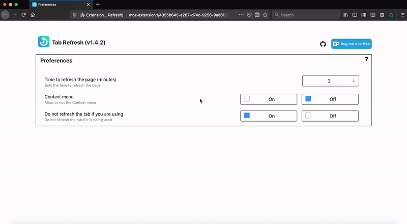

# Tab Refresh 

Using this Add-on you can set the time in minutes for the refresh page, it is possible to do this by adjusting in the preferences going in about:addons or by clicking on the gear in the top right corner. It works by refreshing the page every x minutes so that you don't be disconnected in the login timeout.

## Requirements
* Firefox 57.0 or later

## Features
This add-on will have more updates that will add new features, as requested in the reviews. Currently has the following features:
* Set time to refresh tab in Add-on preferences
* Context menu

## How Contribute
Have a suggestion, doubt or encountered an error? Please open a new [issue](https://github.com/jhonatasrm/tab-refresh/issues)

## Learn More 
To learn more about webextensions development, see this [Mozilla developer Network documentation](https://developer.mozilla.org/en-US/Add-ons/WebExtensions)

## License
This repository is available under the [Mozilla Public License, version 2.0](https://github.com/jhonatasrm/tab-refresh/blob/master/LICENSE)

